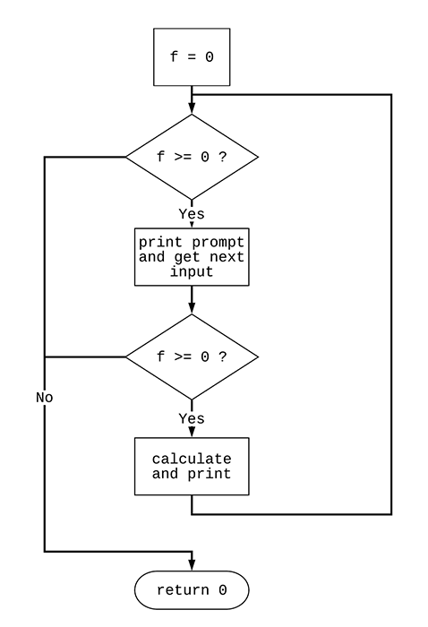
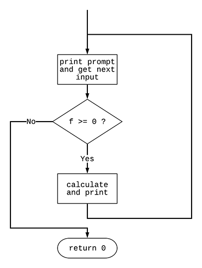

# Project - More sophisticated logical selection

## Goal

Starting with the code supplied here:

```c++
#include <iostream>                                                     // 1 
                                                                        // 2 
using namespace std;                                                    // 3 
                                                                        // 4 
int F2C(int degrees) { return 5 * (degrees - 32) / 9; }                 // 5 
                                                                        // 6 
int main() {                                                            // 7 
  int degrees = 0;                                                      // 8 
  int celsius;                                                          // 9 
                                                                        // 10 
  while (degrees >= 0) {                                                // 11 
    cout << "Enter degrees (negative quits): ";                         // 12 
    cin >> degrees;                                                     // 13 
    if (degrees < 0)                                                    // 14 
      break;                                                            // 15 
    celsius = F2C(degrees);                                             // 16 
    cout << degrees << " in degrees is " << celsius << " in celsius" << endl; // 17 
  }                                                                     // 18 
  return 0;                                                             // 19 
}                                                                       // 20 
```

you are going to:

* design an algorithm which allows the user to select the direction of
the conversion (F to C or C to F).

* flowchart the algorithm

* write the program that implements the algorithm.

## Review

Functions are bundles of potentially reusable code that
perform some block of statements that make logical sense to group
together.

Functions can often be likened to verbs - do
*something*. In the case of our supplied version of the temperature
conversion program, we define a function called `F2C()` found on
`line 5` which accepts
an integer argument (or parameter) and allows us to reuse the function
with any value of degrees.

Functions can return values. The type of the function defines the
type of its return value. `F2C()`, as given on `line 5` is marked
as returning an `int`. In particular, `F2C()` is fed an integer
(called `degrees`) which indicates a temperature in Fahrenheit. The
function computes and returns the equivalent temperature in the
Celsius scale.

Note that some functions do *not* return
values. These functions are given the type `void`.

Functions are a **good idea**. They break down our
designs into smaller ideas which are more understandable.

All C++ programs (that we will be writing) must include
a function called `main()`. This function is special only due to its
name. It is
where your program will begin execution.

We know that we can print out something to the user using `cout` and
read in something from the user using `cin`. For now, we know
that `cout` is your screen and `cin` is your keyboard. There is a lot
more to learn about "streams" such as `cin` and `cout` in the future.

`Line 12` contains a `while` loop: *While a certain condition evaluates
to true* repeat a block of code*. After the block of code executes,
control transfers back up top where
the condition is evaluated again. If the condition is now false, control
transfers to after the end of the block nested under the `while`.

`while` loops are described in chapter 4.2. and 4.3.

One way of escaping a `while` loop early (i.e. from
within the middle of the block of code), is using a `break` statement.

`break` and its cousin `continue` are described in chapter 4.9.

`break` statements can exist only inside loops and in
one other place, but we haven't learned about the other place yet
(hint: it's called a `switch` statement and is described in chapter
3.11).

We learned about flowcharting. We learned that flowcharts help us design
algorithms by putting pictures and symbols to the sequence of steps the
algorithm will contain.

Flowcharts are good design tools. Here is the flowchart for the program
above. Take a few moments to compare the code to the flowchart. Where
you see `f` in the flowchart, think `degrees`.



Here is a slightly cleaner way of writing the same code:

```c++
#include <iostream>                                                     // 1 
                                                                        // 2 
using namespace std;                                                    // 3 
                                                                        // 4 
int F2C(int degrees) { return 5 * (degrees - 32) / 9; }                 // 5 
                                                                        // 6 
int main() {                                                            // 7 
    int degrees;                                                        // 8 
    int celsius;                                                        // 9 
                                                                        // 10 
    while (true) {                                                      // 11 
        cout << "Enter degrees (negative quits): ";                     // 12 
        cin >> degrees;                                                 // 13 
        if (degrees < 0)                                                // 14 
            break;                                                      // 15 
        celsius = F2C(degrees);                                         // 16 
        cout << degrees << " in degrees is " << celsius << " in celsius" << endl; // 17 
    }                                                                   // 18 
    return 0;                                                           // 19 
}                                                                       // 20 
```

Why is this cleaner? Look:



The key idea that made the second version cleaner is the construction
`while (true)` on `line 11` which always evaluates to `true`.
Execution falls directly into the
user's entrance of the value for degrees. Notice the arrow leading
in from the top proceeding directly to "print prompt...". This is
the `while (true)`.

If the value that is input it negative (`line 14`) the loop
exits using `break` (`line 15`).

Notice this flowchart does not contain an initialization of `f` (`degrees`).
This is because it is no longer necessary. Can you see why?

## if statements

We have learned about `if` statements in class. Let's make use of them
in an assignment. Your instructor has been a little sneaky here
(instructors usually are, but it's all for the good).

The `while` loop contains an implicit `if` statement within it. Above we
said *while a certain condition evaluates to true* enter the block of
code. The implicit `if` is that you enter the block of code only `if`
the condition evaluates to true.

The program you will write is more flexible than the given to you.
This project's code asks the user which direction they want to perform
a temperature conversion.

After you prompt the user, they
choose between converting from F to C or from C to F. They can also
elect to quit the program.

Here is what your output should look like:

```text
Select from F, C or Q (to quit): F
Enter degrees F: 32
32 F is 0 degrees C.
Select from F, C or Q (to quit): C
Enter degrees C: 100
100 C is 212 degrees F.
Select from F, C or Q (to quit): SPLAT!
Bad command.
Select from F, C or Q (to quit): Q
```

The snippet above shows all of the potential code paths including
what to do if the user enters something other than F, C or Q.

## Requirements

You will use some combinations of `if`, `else if` and
`else`.

You are to turn in a flowchart showing the structure of your program.
Remember that diamonds are used for `if` statements. Also remember to
label the outputs of the diamonds. Turn this in as a photograph uploaded
to Schoology as part of what you turn in.

You are to write the corresponding program. 

Your code and flowchart
should match.

## What to turn in and how

Use schoology to turn in only your one cpp source code file. Take
a picture of your drawn flowchart and turn that in as well as a
JPEG file.

## Work Rules

This project is to be done solo.
