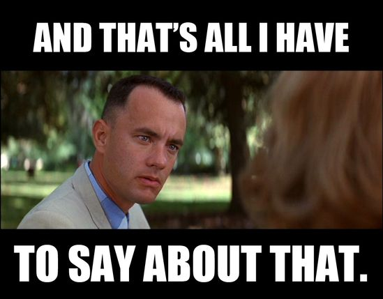

# Checking BBP

In this project you're practicing using files for input, using vectors as
stacks and using `argc` and `argv`. Specifically:

* You'll get the name of a file to check from the command line.

* You'll open this file for reading if you can. If the open fails,
  you'll print an error message and quit.

* You'll read every line of the file keeping track of all opening and
  closing parentheses, braces and brackets.

* You'll be careful to skip to the next line if you encounter two
  slashes in a row (`//`). This means the rest of the line is a
  comment. This *might* be the hardest part of the program.

* After reaching the end of the file (and closing it), you will print
  out whether or not the file is balanced with respect to these marks in
  the way that a C++ program would be.
  
* You'll exit the program *before* reaching the end of the input file if
  you discover a mismatched or unbalanced bracket, brace or parenthesis.

You will use `vector` to make a `stack`.

A `stack` is also called a `LIFO` for Last In First Out. Imagine the
trays in the cafeteria. If a worker added trays to the hopper one by
one, the last one placed onto the *stack* of trays would be on top. And
so, it would be the first one to be removed. This is the genesis of the
term `LIFO`.

## Using `vector` as a stack

Assume `v` is a `vector`.

`v.push_back()` appends a value onto the back of the `vector`. The
**back** of the `vector` plays the role of the top of the `stack`.

`v.back()` allows you to read the last value in a `vector`. This is how
you'll check the top of the `stack`. In `stack` parlance, this is a
`peek`.

`v.pop_back()` deletes the last value in a `vector`. This is how
you'll remove the top of the `stack`. If you need the last member of the
`vector`, remember to fetch the value of the last member with `v.back()`
before calling `v.pop_back()` since `v.pop_back()` is a `void` method -
it returns nothing.

## Pushing on to the `stack`

After reading a line from the file, go through it character by
character. When you encounter `{`, `[` or `(`, push it onto the `stack`
using `v.push_back()`. No error can be encountered in this step.

## Popping off the `stack`

When you encounter a closing punctuation mark such as `}`, `]` or `)`
you must inspect the stack:

* Is the `stack` empty? If so, you have an unbalanced closing mark.

* Is the top of the `stack` a different mark? If so, you have an
  unbalanced closing mark.

If neither of the above are true, the mark on top of the `stack` must be
the matching open to the closing mark you just encountered. Use
`v.pop_back()` to remove it signifying that you have mated a closing
mark to the correct opening mark.

If you encounter an error you must exit the program after printing an
informative error message.

## All Printed Error Messages

**All** printed error messages must go to `cerr` and your program must
return a value of 1 from `main()`. Return a value of 0 if the file
is balanced.

The message reporting success should be printed to `cout` and the
program shall return 0.

You can check the value returned by your program using:

```text
echo $?
```

from a Unix-like terminal - Linux and Mac for example. 

From a Windows, it's a completely intuitive:

```text
echo %errorlevel%
```

In PowerShell there are no errors. It's just that powerful. Seriously,
who uses PowerShell anyway?

## Count the lines

If you find a error, the error message must include the line number on
which the error was found.

If you do not find an error, the success message must include the
total number of lines read.

## What could be the hardest part

If, on a line, you encounter a `/`, you must check the next character
to see if it is another `/`. If it is, the rest of the line must be
skipped. So, for example, encountering this:

```text
{
	// These marks {, [, and ) won't break the file.
}
```

will report as balanced. Because the rest of the line is skipped after
encountering `//`, the unbalanced marks don't count.

There are at least two ways in which this could be hard. One involves
nested loops and the other relates to indices.



## Samples

All samples could have been spread over multiple lines.

### Good input

* `{([])}`
* `{ happy happy ( joy joy ) }`

   Note that the words (anything other than a parenthesis, brace or
   bracket) are ignored.

### Bad input

* `{([)]}`

   The first `)` attempts to close a `[`.

* `{([])}}`

   There is an extra `}` at the end.

* `{ happy happy ( joy joy )`

   There is a missing closure to the `{`.

## Command line arguments

This topic is worth reviewing and amplifying.

You may have seen this:

```c++
int main() {
}
```

This is not the whole story however. The complete signature of the
`main()` function is this:

```c++
int main(int argc, char * argv[]) {
}
```

The parameters that are passed to `main()` are the arguments specified
on the command line when the program is run (prepended with the name of
the program being run).

The syntax of `char * argv[]` means that `argv` is an array of
*pointers* to characters. *Pointer* is a fancy way of saying *address*.
Everything in a running program's memory space has an address. It isn't
important to master *pointers* right now. It is worth mentioning that
*pointers* seem to scare a lot of people, but when you realize that
everything is an *address* they really aren't that scary.

### Source code

Rather than ask you to write a program to enumerate a program's command
line arguments, I'll just show you - a couple of ways - with
explanation.

[Method 1](./args1.cpp)

[Method 2](./args2.cpp)

Here is a sample of outputs of either program:

```text
hyde pk_1810_practice $> ./a.out
Argument [  0] is ./a.out
hyde pk_1810_practice $> ./a.out pokwrf pokwrfwwrfwrf "powpok pok pok"
Argument [  0] is ./a.out
Argument [  1] is pokwrf
Argument [  2] is pokwrfwwrfwrf
Argument [  3] is powpok pok pok pok
hyde pk_1810_practice $>
```

`args1.cpp` shows the basic usage of command line arguments.

`args2.cpp` shows enumerating command line arguments in a more advanced
way and serves only as a teaser for your future understanding of scary
pointers. Hint: pointers are not scary.

### Common mistake

Things can end in tears (EiT) if you attempt to use an argument that
isn't there. So, don't do that. Check `argc` to determine if any
particular index into `argv` is valid or not.

<figure>
  
  <figcaption style="width:60%">
  Before accessing a thing, make sure the thing exists!
  </figcaption>
</figure>

## Suggestions

Create two boolean functions:

```c++
bool IsOpening(char c);
bool IsClosing(char c);
```

These will return true if the character passed to them are the right
kind of marks.

Create another boolean function:

```c++
bool IsMatch(char c, char top_of_stack);
```

This will return true if the closing mark matches the right kind of
opening mark.

Use these to make your main code much easier to read.

## Sample output

```text
hyde pk_bbp_stack $> ./a.out test1.txt
2 lines read. All balanced.
hyde pk_bbp_stack $> ./a.out test2.txt
6 lines read. All balanced.
hyde pk_bbp_stack $> ./a.out test3.txt
Unbalanced: } on line: 4
hyde pk_bbp_stack $> ./a.out test4.txt
1 lines read. Extra: {
hyde pk_bbp_stack $> ./a.out test5.txt
Unbalanced: ] on line: 3
hyde pk_bbp_stack $>
```

## Test files

I have supplied a number of test files.

[test1.txt](./test1.txt) contains one opening and one closing brace.

[test2.txt](./test2.txt) contains multiple nested marks properly
balanced.

[test3.txt](./test3.txt) contains a mismatch on line 4.

[test4.txt](./test4.txt) contains an opening mark with no close.

[test5.txt](./test5.txt) contains an extra closing mark.

[test6.txt](./test6.txt) contains a closing mark with no opening.

Notice how these descriptions match up to the output of the sample runs.

## Work rules

All work is to be done solo.

## What to hand in

Only `.cpp` files.

## Setting expectations

This is not a competition... my solution was 110 lines including
comments. I provide this figure only to set your level of expectation.
If, for example, you find yourself writing 300 lines, you're doing it
"wrong."

## Incremental development

<figure>
  
  <figcaption style="width:60%">
  You should write test data and test
  code that tests just the piece of code you're working on right now.
  </figcaption>
</figure>
