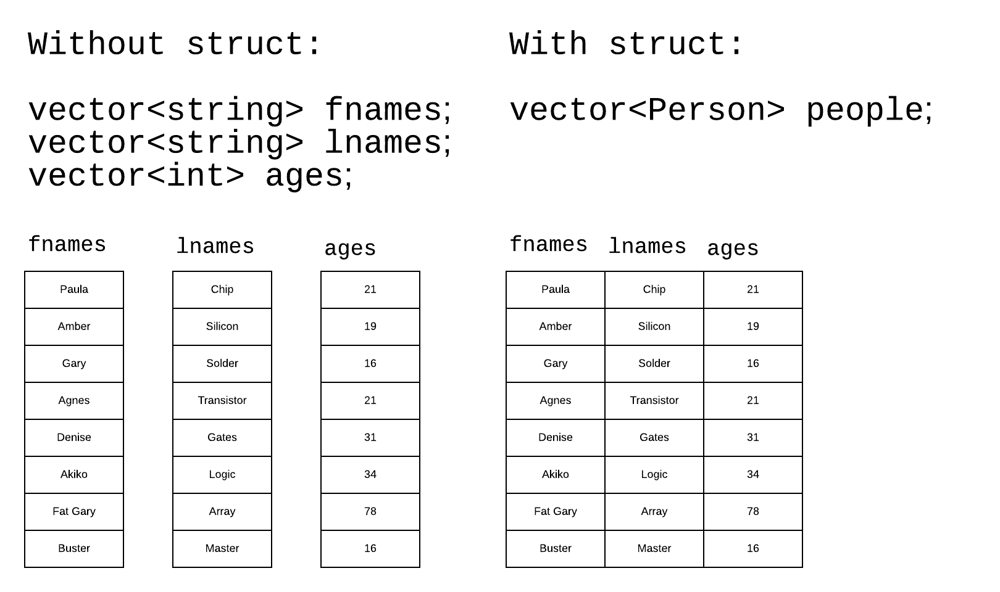

# Introduction to Structs

You by now have lots of practice with built-in types such as `float`,
`int`, etc.

You also have practice with incorporating these basic types into certain
containers such as `vector`.

Now comes time to create your own types.

`struct` is a means of building a more complicated type from simpler
parts. `struct` was introduced in C. In C++, structs were promoted to
being nearly identical to the powerful C++ feature `class`. In fact,
everything you learn in this project about `struct` can be applied (with
next to no changes) to an implementation using `class`.

Suppose we wanted to model a collection of "people" using strings for
first name and last and plus an integer for age. Without structs we must
resort to using three data structures. This is awkward and error prone.

With a `struct` we can join all the three attributes we wish to model
about people into a single unit.



## Defining a `struct`

Continuing from the example above:

```c++
struct Person {
	string fname;
	string lname;
	int age;
};
```

Then, the `struct` can be used like any type:

```c++
// Make one person.
Person p;

// Make a vector of persons.
vector<Person> people;
```

## Accessing members of a `struct`

There is more than one syntax for accessing members of a `struct`. In
this project, we will use the basic form (assuming `p` as defined
above):

```c++
cout << p.fname << " " << p.lname << " " << p.age << endl;
```

That is, the `struct`'s name followed by a period (dot) followed by
the *member's* name.

## The `struct` in this project

```c++
struct Student {
	string fname;
	string lname;
	string student_id;
	int age;
	vector<int> scores;
};
```

## The data in this project

A [data file](./data.csv) has been provided to you. The beginning of the
file is shown here:

```csv
Eugenio,Riley,00044249,20,87,91,86,79,96,33,88,96
Engelmann,Caroline,00038445,19,75,95,72,84,97,75,29,72
Riebow,Anya,00008913,18,88,75,100,93,90,76,95,70
```

You can assume there are no errors in the formatting of this file.

The columns are:

| index | meaning |
| ----- | ------- |
| 0 | last name |
| 1 | first name |
| 2 | student id |
| 3 | age |
| 4 | score[0] |
| 5 | score[1] |
| 6 | score[2] |
| 7 | score[3] |
| 8 | score[4] |
| 9 | score[5] |
| 10 | score[6] |
| 11 | score[7] |

The file, as can be seen, is a `csv` file. You are provided with a csv
splitter:

* [Here](./simple_csv.hpp) is the header file.

* [Here](./simple_csv.cpp) is the C++ source code.

## Using more than one source code file

As projects become larger, they should be split into multiple source
code files so that the code that is most closely related to other code
should be in the same file. With less to look at at a given time, it is
likely you'll understand the code more easily.

Each source code file will be independently run through:

* The preprocessor that handles preprocessor directives like `#include`

* The (actual) compiler that turns high level code into assembly
language

* The assembler that turns assembly language into machine code

Finally, at the linking stage, the machine from each separate source
code file is *linked together* to form a single executable file.

The "compiler" (using the term for the umbrella program) can be run
individually on each source code file *or* the "compiler" can be
run with all the source code files at once. An example of this
second choice is shown here and assumes three source code files:

```text
g++ -Wall -g -std=c++11 a.cpp b.cpp c.cpp
```

One of these source code files must contain the function `main()`.

The umbrella "compiler" will apply the three given options
individually to each of the three given source code files and then run
the linker to bring them all together to create an executable.

Suppose your main code file for this project is called "main.cpp",
then building your executable might look like this:

```text
g++ -Wall -g -std=c++11 main.cpp simple_csv.cpp
```

## Using the simple splitter

You should read each line at a time using `getline()`. This function
returns a C++ `string`. Then, send the result of `getline()` to
`SimpleSplit()` like so:

```c++
vector<string> tokens = SimpleSplit(line, ',', SS_NOQUOTES | SS_TRIM);
```

Notice the single `|`? That is a *bitwise or*. You have seen the double
`||` which is the *logical or*. The single `|` works on individual
bits while the double `||` works with booleans. You will learn more
about bitwise processing in future classes.

The function takes a full line of text and returns the text split
into individual tokens according to the comma separated file format.

## Specifying the file

The file name is to be provided to your program via the command line.
Remember to ensure that the command line argument is provided. A quick
way to lose points is to simply assume the argument is present.

If the file is absent or cannot be opened, print a message and exit. As
this is an error, the return code from `main()` must be `1` and not `0`.

Further, as this is an error, use `cerr` to print an appropriate message
and not `cout`.

## Menu

After reading the file, you will *repeatedly* offer the user a menu of
actions they can take. This should be in a loop which ends when either
a) the user enters the EOF (end of file) character or b) the user enters
the line: `q`.

The menu must look like this:

| mnemonic | action |
| -------- | ------ |
| mh | find students who have more than one 100 |
| ha | find the students who share the highest average |
| z | find students who have at least one zero |
| q | quits the program |

## Averages are rounded

For the purpose of the `ha` command, round the computed average to the
nearest integer using the `round()` function found in `cmath`.

## Samples of all cases

### No file given:

```text
pk_intro_to_structs $> ./main
A file name must be provided.
pk_intro_to_structs $>
```

### Bad file name given:

```text
pk_intro_to_structs $> ./main okokokok
Could not open: okokokok
pk_intro_to_structs $>
```

### File loaded - commands run:

```text
pk_intro_to_structs $> ./main data.csv
500 student records loaded.
Menu:
mh - find students with more than one 100
ha - find all students sharing highest average
z  - find students with at least one zero
q  - quit the program
Your choice: mh
Students with more than one one hundred:
   Weisensel       Diana  00025519 has 2 scores of 100
       Lutzi       Chloe  00037540 has 2 scores of 100
     Krasley    Kadiatou  00017899 has 2 scores of 100
      Fazzio       Aiden  00054363 has 2 scores of 100
      Patina     William  00008354 has 2 scores of 100
       Obear         Noa  00001989 has 2 scores of 100
    Bultinck        Alec  00051335 has 2 scores of 100
Menu:
mh - find students with more than one 100
ha - find all students sharing highest average
z  - find students with at least one zero
q  - quit the program
Your choice: z
Students with at least one zero:
    Steffens      Landon  00056329 has 1 zero
  Cagliostro     Michael  00033670 has 1 zero
  Ignatovich    Theodore  00005524 has 1 zero
     Teodoro    Anderson  00036037 has 1 zero
       Geroy       Silas  00015365 has 1 zero
Menu:
mh - find students with more than one 100
ha - find all students sharing highest average
z  - find students with at least one zero
q  - quit the program
Your choice: ha
The highest average is: 93
Held by these student(s):
   Hoffpavir        Emma  00019118
     Bonwell        Milo  00029597
Menu:
mh - find students with more than one 100
ha - find all students sharing highest average
z  - find students with at least one zero
q  - quit the program
Your choice: q
pk_intro_to_structs $>
```

In the above print-outs, first and last names are set to 12 spaces in
width via `setw()`. The student id number is set to 10 spaces in width.

## Suggestions for functions for you to write

### `PrintMenu()`

This function just prints the menu you see above. Mine has this
signature:

```c++
void PrintMenu();
```

### `FindZeros()`

This function handles all of the chore of finding all students who have
at least one zero. Mine has this signature:

```c++
void FindZeros(vector<Student> & students);
```

### `FindAverage()`

This function computes and rounds the average of the `scores` in each
`Student`.

Mine has this signature:

```c++
double FindAverage(vector<int> & scores);
```

### `FindHighestAverage()`

This function handles all of the chores needed to find all students
sharing the highest average.

Mine has this signature:

```c++
void FindHighestAverage(vector<Student> & students);
```

## Role of `&` in my signatures

Placing an ampersand (`&`) before a parameter's name makes it a
"pass by reference". Notice here:

```c++
void FindZeros(vector<Student> & students);
```

Suppose we are a really successful school with 7 billion students.
That's a mighty big `vector` of `Students`. It would be very costly in
times of both time and space to copy the `vector` with each function
call. Passing it by reference to the original data is, by contrast,
lightning fast and super space efficient (because we're passing
nothing but the reference itself backed by the original data).

## Work rules

All work is to be done solo.

## Setting expectations

My implementation has 140 lines. This is not a challenge or test. This
information is given only to allow you to scale your expectations. If
you're exceeding this number of lines *by a lot* maybe you should
rethink what you're doing.
